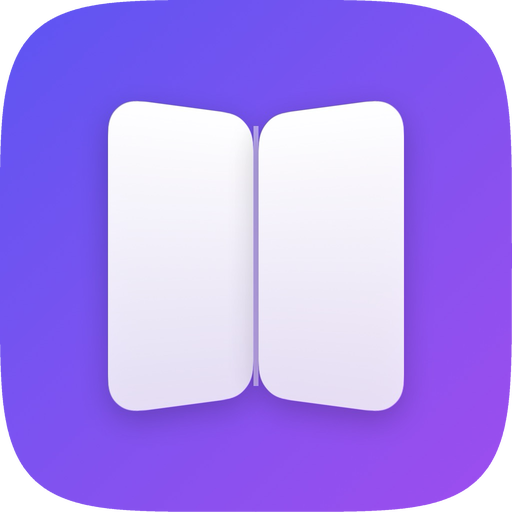
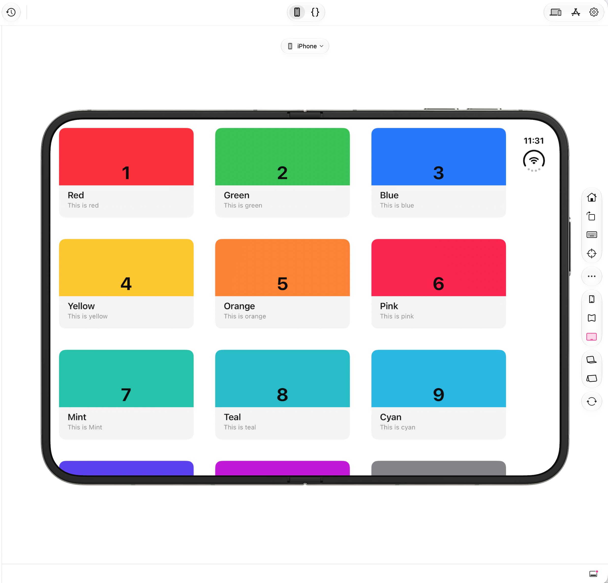
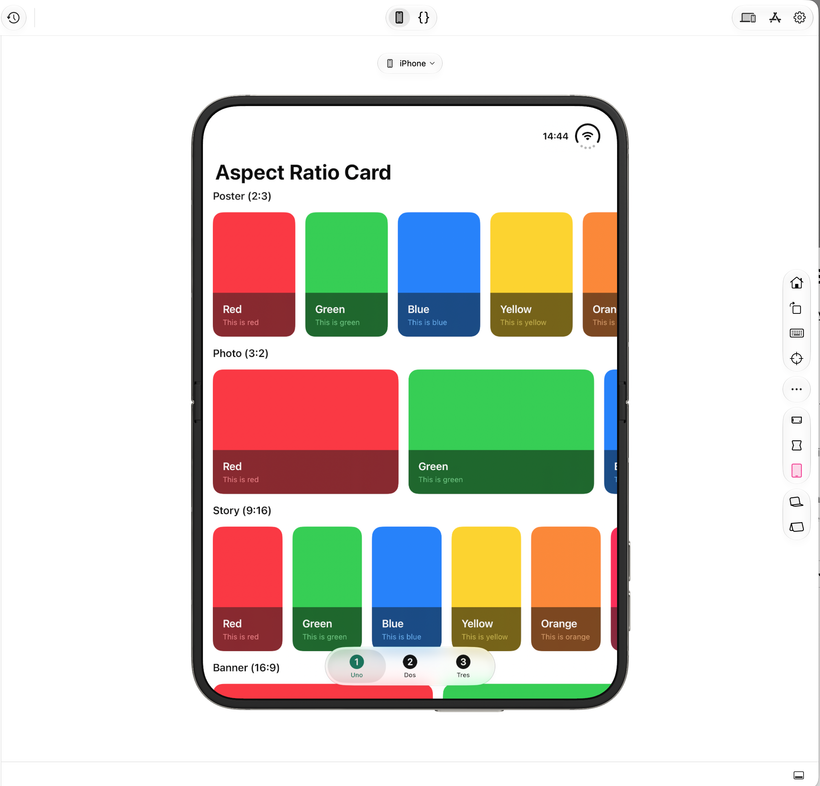
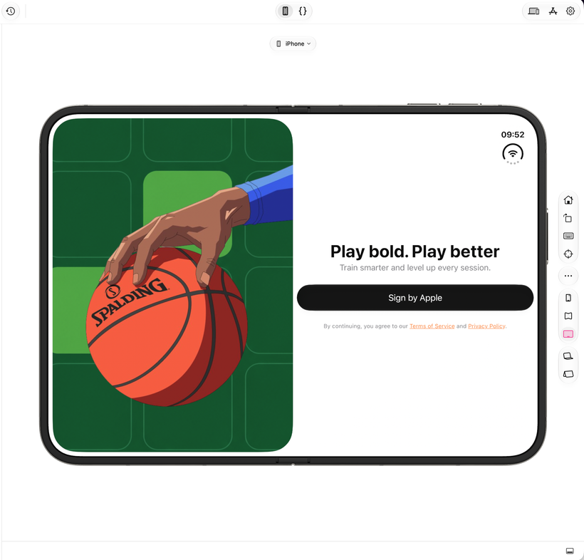
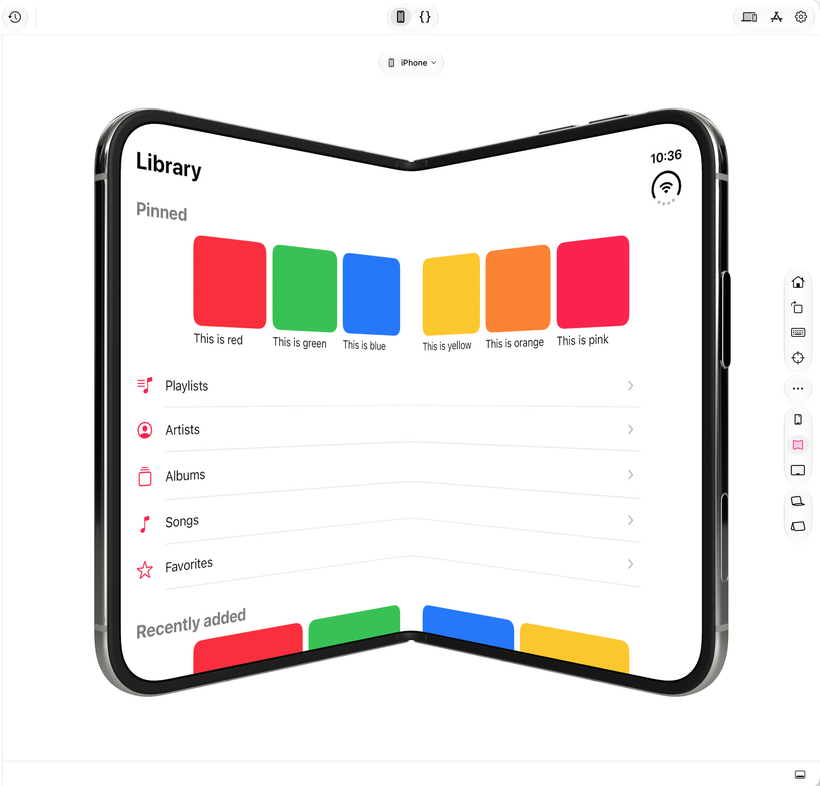
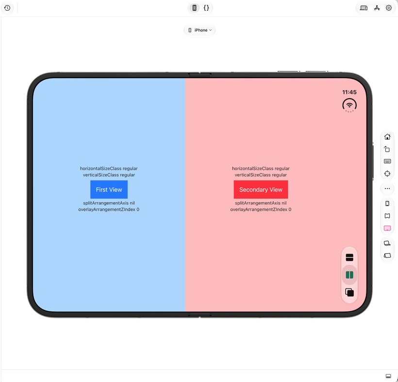
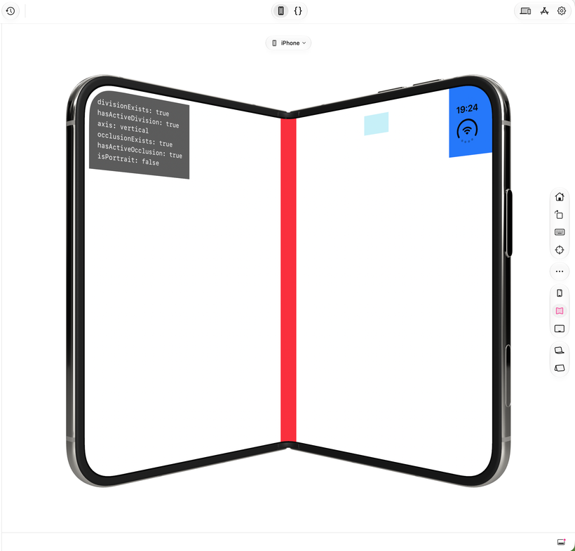

  

# IphoneDuo Examples
SwiftUI examples for the iPhone Duo (foldable iPhone) APIs in iOS 27.1: hinge, reserved regions, ArrangementView, vertical toolbar

  
  
  
  

## Technology

This project is built with native Apple technologies for iPhone Duo:

- **Swift 6** and **SwiftUI**, using the iOS 27.1 SDK and Xcode 27.1.
- **Swift Charts** for the hinge-angle history example.
- **iPhone Duo SwiftUI APIs** including `onHingeChange`, reserved regions, `ArrangementView`, the vertical bar toolbar APIs, container content margins, and geometry-driven adaptivity.
- **SwiftUI-first architecture** with no UIKit examples, so every sample stays focused on the APIs and layout behavior available to SwiftUI.

## Getting Started

**Requirements:** Xcode 27.1 or later, and the iPhone Duo simulator (iOS 27.1) or an iPhone Duo.

Custom Hinged Layout
## Examples
<table>
<tr>
<td width="50%" valign="top">

<a href="https://www.patreon.com/Codelaby/posts/event-columns-171868372"><b>Even Columns Responsive Grid for iphoneDuo, ipad, iphone</b></a>

This code creates a flexible screen design (layout) that automatically changes how items are displayed based on your device's screen size or fold state (like on foldable phones).

</td>
<td width="50%" valign="top">

<a href="https://www.patreon.com/Codelaby/posts/flexible-aspect-171589892"><b>Flexible Aspect Ratio Cards</b></a>

Showcase horizontal collections of card components with dynamic aspect ratios across three layout approaches.

</td>
</tr>
<tr>
<td width="50%" valign="top">

<a href="https://www.patreon.com/Codelaby/posts/compatarrangemen-171474092"><b>CompatArrangementView</b></a>

This code creates a smart, flexible screen layout that automatically rearranges content to fit different screen sizes, orientations, and folding devices (like dual-screen or foldable phones).

</td>
<td width="50%" valign="top">

<a href="https://www.patreon.com/Codelaby/posts/custom-hinged-171198337"><b>Custom Hinged Layout</b></a>

The code implements a hinged/dual-screen layout system in SwiftUI designed for foldable devices (such as dual-screen hardware exposing reserved regions via GeometryProxy). It splits collection items dynamically across two display pages (primary and secondary) separated by a hinge/fold division.

</td>
</tr>
<tr>
<td width="50%" valign="top">

<a href="https://www.patreon.com/Codelaby/posts/about-for-170781766"><b>About ArrangementView</b></a>

This file demonstrates the usage of Apple's ArrangementView API

</td>
<td width="50%" valign="top">

<a href="https://www.patreon.com/Codelaby/posts/detecting-on-duo-170278132"><b>Detecting Reserved Regions</b></a>

This SwiftUI view (ReservedRegionsInfo) uses a GeometryReader to query and render screen cutouts and physical device boundaries:

</td>
</tr>
</table>

## See Also

Apps and games built for iPhone Duo, where folding the device is the whole point.

<table>
<tr>
<td width="80"></td>
<td><a href="https://github.com/artemnovichkov/Accorduon"><b>Accorduon</b></a> An accordion where the hinge is the bellows. Fold and unfold to play.</td>
</tr>
<tr>
<td width="80"></td>
<td><a href="https://github.com/artemnovichkov/SandValley"><b>SandValley</b></a> Pour sand on the screen and fold the device to make it slide into the valley.</td>
</tr>
<tr>
<td width="80"></td>
<td><a href="https://github.com/artemnovichkov/Duogami"><b>Duogami</b></a> An origami workshop. Fold the phone to fold the paper, one crease at a time.</td>
</tr>
<tr>
<td width="80"></td>
<td><a href="https://github.com/artemnovichkov/ClawKit"><b>ClawKit</b></a> A clay claw machine. The cabinet stands above the fold, the controls sit below it.</td>
</tr>
<tr>
<td width="80"></td>
<td><a href="https://github.com/artemnovichkov/DuoBird"><b>DuoBird</b></a> Flappy Bird played with the hinge. Snap the device open to flap through the pipes.</td>
</tr>
<tr>
<td width="80"></td>
<td><a href="https://github.com/artemnovichkov/DuoCut"><b>DuoCut</b></a> The fold is a blade. Slide shapes under it and cut them in half.</td>
</tr>
</table>

## Resources

- [Get Ready for iPhone Duo](https://developer.apple.com/iphone-duo/)
- [Preparing your app for iPhone Duo](https://developer.apple.com/documentation/technologyoverviews/preparing-your-app-for-iphone-duo)
- [Designing for iPhone Duo](https://developer.apple.com/design/human-interface-guidelines/designing-for-iphone-duo) in the Human Interface Guidelines
- Tech Talks:
  - [Prepare your app for iPhone Duo](https://developer.apple.com/videos/play/tech-talks/111461/)
  - [Raise the bar with iPhone Duo](https://developer.apple.com/videos/play/tech-talks/111462/)
  - [Strike a pose with adaptive layouts on iPhone Duo](https://developer.apple.com/videos/play/tech-talks/111463/)
  - [Leverage multiple displays and scenes on iPhone Duo](https://developer.apple.com/videos/play/tech-talks/111464/)
  - [Design for iPhone Duo](https://developer.apple.com/videos/play/tech-talks/111466/)
 
## More info
[Repository based for this iPhoneDuo Adaptative](https://github.com/hoangchungk53qx1/iPhone-Duo-Adaptive/tree/main)
